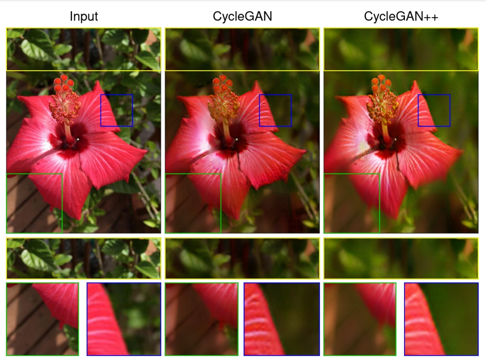

# CycleGAN++ in PyTorch

This repository contains a PyTorch implementation for unpaired image-to-image translation using the CycleGAN++ model.
<br>

<br><br>
This implementation builds upon the original CycleGAN [Paper](https://arxiv.org/pdf/1703.10593.pdf) work.

## Prerequisites
- Linux or macOS
- Python 3.12
- CPU or NVIDIA GPU + CUDA CuDNN

## Getting Started
### Installation

- Clone this repo:
```bash
git clone https://github.com/Mohamadmhm/CycleGANPlusPlus.git
cd pytorch-CycleGANPlusPlus
```

- Install [PyTorch](http://pytorch.org) and `>=1.4` and other dependencies (e.g., torchvision, [visdom](https://github.com/facebookresearch/visdom) and [dominate](https://github.com/Knio/dominate)).
  - For pip users, please type the command `pip install -r requirements.txt`.
  - For Conda users, you can create a new Conda environment using `conda env create -f environment.yml`.

### CycleGAN train/test
- Download a CycleGAN dataset (e.g. horse2zebra):
```bash
bash ./datasets/download_cyclegan_dataset.sh horse2zebra
```
- To view training results and loss plots, run `python -m visdom.server` and click the URL http://localhost:8097.
- To log training progress and test images to W&B dashboard, set the `--use_wandb` flag with train and test script
- Train a model:
```bash
python train.py --dataroot ./datasets/horse2zebra/ --name horse2zebra --model cycle_gan_plusplus
```
To see more intermediate results, check out `./checkpoints/horse2zebra/web/index.html`.
- Test the model:
```bash
python test.py --dataroot ./datasets/horse2zebra/ --name horse2zebra --model cycle_gan_plusplus
```
- The test results will be saved to a html file here: `./results/horse2zebra/latest_test/index.html`.

## Citation
If you use this code for your research, please cite the original CycleGAN paper:
```
```
